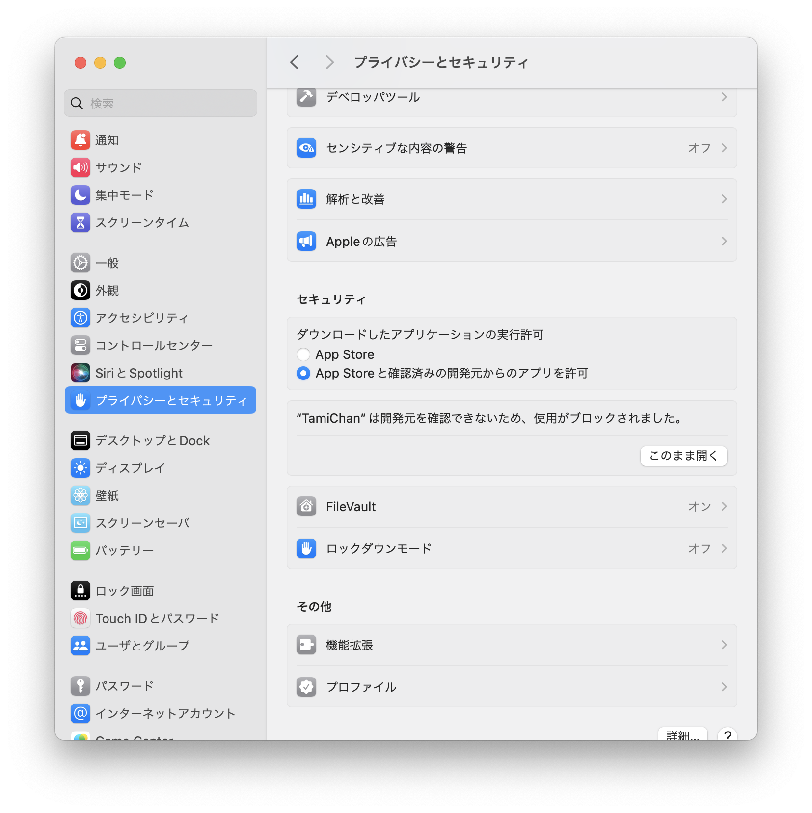

# デスクトップマスコット たみちゃん

[English README is here](https://github.com/sabanishi/TamiChan/blob/main/README.md)

## Installation

Releasesから最新のバージョンの物をダウンロードして使用してください。

zipファイルを解答し、TampChan.appを実行してください。
以下のような警告が出た場合、システム設定から「プライバシーとセキュリティ」を開き、「このまま開く」を押してください。

## System Requirements

Mac OS()

## Usage