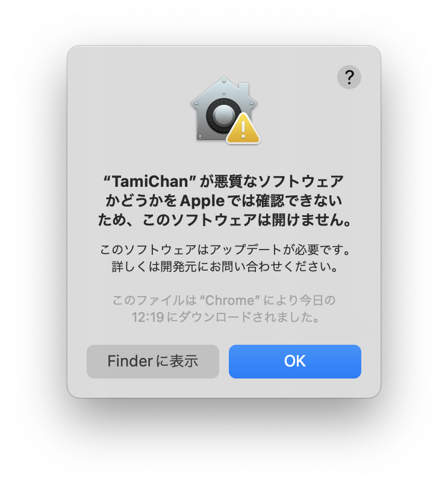

# Desktop Mascot Tami-Chan

[日本語READMEはこちら](https://github.com/sabanishi/TamiChan/blob/main/README-ja.md)


## System Requirements

Mac OS

## Installation

Please download the latest version from Releases.

Unzip the file and run TamiChan.app. If you encounter the following warning, open "Privacy & Security" from system settings and press "Open Anyway."

　

## Usage

### Tami-Chan

You can move Tami-chan by dragging her.

You can also open and close the console by right-clicking.

### Command

You can execute commands by entering messages in the console.

The supported commands are as follows:

<br />

#### Register OpenAI API Key

- By registering the API key, the chat function becomes available.
- Refer to [here] for how to obtain the key.

Command
- `!setup_chat`

Arguments
- `-k`,`--key`: Open API key

Exapmle
```
!setup_chat -k [your api key]
```

<br />

#### Translation

Command
- `!trans`

Arguments
- `-s`, `--sentence`: String to be translated
- `-i`, `--input`: Input language
  - If not specified, it will be automatically detected from the string to be translated.
- `-o`, `-output`: Output language
  - If not specified, it will be Japanese

The languages available for input/output are as follows:

- `en`: English
- `ja`: Japanese
- `fr`: French
- `de`: German
- `nl`: Dutch
- `el`: Greek
- `iw`: Hebrew
- `hi`: Hindi
- `id`: Indonesian
- `it`: Italian
- `ko`: Korean
- `la`: Latin
- `pl`: Portuguese
- `ru`: Russian
- `sv`: Spanish
- `ur`: Urdu

Example
```
!trans -s こんにちは　-i jp -o en
```

<br />

#### Register Git Repository

- By registering a local Git repository, Tami-chan will celebrate with you when you make a new commit.
- Specify the folder containing .git with an absolute path.

Command
- `!git_repo`

Argumnets
- `-p`,`--path`: Git repository path

Example
```
!git_repo -p [.git path]
```
<br />

#### Change Console Size

Command
- `!console_size`

Arguments
- `-w`,`--width`: Width
- `-h`,`-height`: Height

Example
```
!console_size -w 1000 -h 500
```

#### Delete Save Data

- This command deletes all data(OpenAI API,Git Path,...)

Command
- `!delete_data`

Arguments
- None
